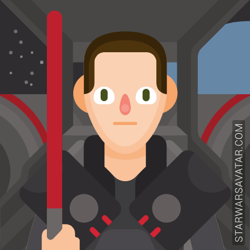

  <h1 align='center'> Hi there! 
    My name's Vyctor and this is my Github personal page  💻
  </h1>

 

  Studying 
  <b>Software Analysis and Development at UNOPAR</b>, 
  <b>Full Stack Developer</b> 
  working at 
  <b>
    <a href="https://pedeomenu.com.br" style="color:#fff;">
      Pede o Menu
    </a>
  </b> 
  with Javascript, Typescript, Angular, Node.js and Firebase/Google Cloud.

  

    
  

  &nbsp;&nbsp;&nbsp;&nbsp;
  &nbsp;&nbsp;&nbsp;&nbsp; 

<h1> 🔭 I’m currently working with ...</h1>

<h2 style="padding: 32px 0; font-weight: bold">🌐 Front-end</h2>

  &nbsp;&nbsp;
  &nbsp;&nbsp;
  &nbsp;&nbsp;
  &nbsp;&nbsp;
  &nbsp;&nbsp;

<h2 style="padding: 32px 0; font-weight: bold">⚙️ Back-end</h2>
  

    &nbsp;&nbsp;
    &nbsp;&nbsp;
    &nbsp;&nbsp;
  

<h2 style="padding: 32px 0; font-weight: bold">🧰 Software and Tools</h2>
  

    &nbsp;&nbsp;
    &nbsp;&nbsp;    
    &nbsp;&nbsp;     &nbsp;&nbsp;
    &nbsp;&nbsp;
  

<h2 style="padding: 32px 0; font-weight: bold">🌱 I'm currently learning...</h2> 

  &nbsp;&nbsp;&nbsp;      
   &nbsp;&nbsp;&nbsp;      
  &nbsp;&nbsp;&nbsp;  &nbsp;&nbsp;&nbsp; &nbsp;&nbsp;&nbsp;  &nbsp;&nbsp;&nbsp;  

